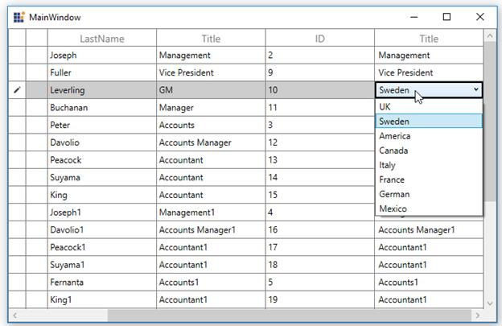

# How to Bind Column ItemsSource from ViewModel in WPF / UWP TreeGrid in MVVM?

This example illustrates how to bind the ComboBox column's **ItemsSource** using MVVM in [WPF TreeGrid](https://www.syncfusion.com/wpf-controls/treegrid) / [UWP TreeGrid](https://www.syncfusion.com/uwp-ui-controls/treegrid) (SfTreeGrid).

You can bind the **ItemsSource** from ViewModel to [TreeGridComboBoxColumn](https://help.syncfusion.com/cr/wpf/Syncfusion.UI.Xaml.TreeGrid.TreeGridComboBoxColumn.html) or using **ElementName** binding.

### XAML:

``` xml
<syncfusion:TreeGridComboBoxColumn AllowEditing="True" 
                                   MappingName="Title"
                                   HeaderText="Title"
                                   ItemsSource="{Binding DataContext.TitleList,
                                                ElementName=treeGrid}" />
```

### C# ViewModel:
``` c#
private ObservableCollection<string> titleList;

public ObservableCollection<string> TitleList
{
     get { return titleList; }
     set { titleList = value; }
}
```


